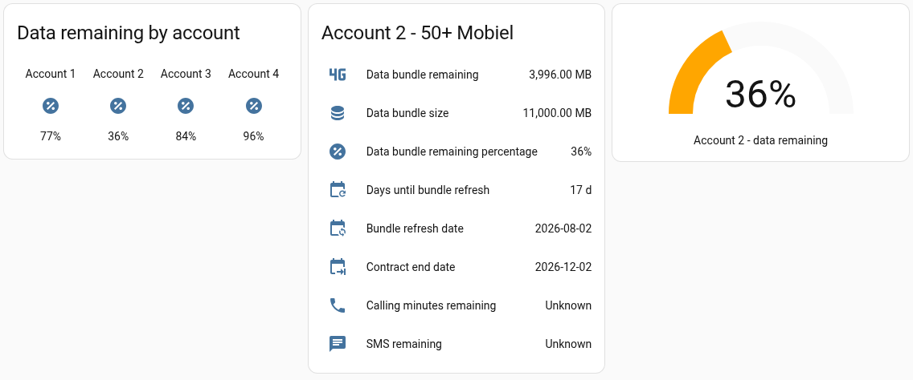

# 50+ Mobiel for Home Assistant


Custom Home Assistant integration for [50+ Mobiel](https://www.50plusmobiel.nl/)
(Dutch MVNO) — reports per-account data bundle usage, refresh date, and
contract end date, and supports multiple accounts (one config entry each, so
one household can track everyone's SIM from a single HA instance).

**This is an unofficial, community-built integration, not affiliated with or
endorsed by 50+ Mobiel.** It talks to their customer portal's unofficial
JSON API — see [`CLAUDE.md`](CLAUDE.md) for how it was reverse-engineered and
what it does. The icon above is an original design, not 50+ Mobiel's logo.

## Installation

### HACS (recommended)

A tagged GitHub release is published, so HACS can install this today as a
**custom repository**: HACS → ⋮ → Custom repositories → add
`https://github.com/yodax/ha-50plusmobiel`, category "Integration" — then
install "50+ Mobiel" and restart Home Assistant. Once default-store
inclusion lands (see [HACS registration](#hacs-registration) below), you'll
be able to just search "50+ Mobiel" in HACS without adding the custom
repository URL first.

### Manual / direct-copy

Copy `custom_components/mobiel50plus/` into your Home Assistant
`config/custom_components/` directory and restart Home Assistant.

## Configuration

Settings → Devices & Services → Add Integration → "50+ Mobiel". Add it once
per account you want to track; each entry asks for that account's email
address and password. There's no in-UI way to add multiple numbers under one
entry — that's intentional, see [Design decisions](#design-decisions).

### Language

The config flow and sensor names are translated into English and Dutch, and
follow your Home Assistant instance's configured language automatically — no
separate setting needed. Other languages fall back to English.

## Sensors (per account)

| Sensor | Unit | Notes |
|---|---|---|
| Data bundle remaining | MB | |
| Data bundle size | MB | |
| Data bundle remaining percentage | % | Server-computed, not derived client-side |
| Days until bundle refresh | days | |
| Bundle refresh date | date | `today + days until bundle refresh` |
| Contract end date | date | `unknown` if the account has no active contract |
| Calling minutes remaining | min | `unknown`/unavailable on unlimited plans — expected, not a bug |
| SMS remaining | count | `unknown`/unavailable on unlimited plans — expected, not a bug |

## Polling & refresh interval

- Each account polls independently on a **30-minute interval**
  (`DEFAULT_SCAN_INTERVAL` in `const.py`) — deliberately conservative since
  this talks to an unofficial, reverse-engineered API. It isn't currently
  exposed as a configurable option in the UI; if you want a different
  interval, edit `DEFAULT_SCAN_INTERVAL` and redeploy.
- Every request carries a 30-second timeout, and a slow/unreachable portal
  surfaces as a normal HA "unavailable" state (`UpdateFailed`) rather than
  crashing the integration.
- You can always trigger an immediate refresh from **Developer tools →
  Actions → `homeassistant.update_entity`**, or via the reload button on the
  integration's entry in Settings → Devices & Services.

## Dashboard cards

These are real cards rendered against live account data (three household
members' actual 50+ Mobiel bundles), built from the sensors above:



Left to right: a **glance card** comparing data-remaining-% across every
account, an **entities card** listing one account's full sensor set, and a
**gauge card** highlighting a single account's percentage. All three are
built-in Lovelace card types — no extra HACS frontend cards required.

```yaml
# Glance card — quick per-account comparison
type: glance
title: Data remaining by account
entities:
  - entity: sensor.YOUR_ACCOUNT_1_data_bundle_remaining_percentage
    name: Account 1
  - entity: sensor.YOUR_ACCOUNT_2_data_bundle_remaining_percentage
    name: Account 2
  - entity: sensor.YOUR_ACCOUNT_3_data_bundle_remaining_percentage
    name: Account 3

# Entities card — one account's full sensor set
type: entities
title: Account 2 - 50+ Mobiel
entities:
  - entity: sensor.YOUR_ACCOUNT_data_bundle_remaining
    name: Data bundle remaining
  - entity: sensor.YOUR_ACCOUNT_data_bundle_size
    name: Data bundle size
  - entity: sensor.YOUR_ACCOUNT_data_bundle_remaining_percentage
    name: Data bundle remaining percentage
  - entity: sensor.YOUR_ACCOUNT_days_until_bundle_refresh
    name: Days until bundle refresh
  - entity: sensor.YOUR_ACCOUNT_bundle_refresh_date
    name: Bundle refresh date
  - entity: sensor.YOUR_ACCOUNT_contract_end_date
    name: Contract end date
  - entity: sensor.YOUR_ACCOUNT_calling_minutes_remaining
    name: Calling minutes remaining
  - entity: sensor.YOUR_ACCOUNT_sms_remaining
    name: SMS remaining

# Gauge card — single account, at-a-glance percentage
type: gauge
entity: sensor.YOUR_ACCOUNT_data_bundle_remaining_percentage
name: Account 2 - data remaining
min: 0
max: 100
severity:
  green: 50
  yellow: 20
  red: 0
```

The `name:` override on each row is optional — it's what keeps the card
generic instead of showing your device's actual display name (which defaults
to whatever you titled that config entry, e.g. "Jane's Phone Data bundle
remaining"). Drop the overrides if you're fine with your own account names
showing.

Swap `sensor.YOUR_ACCOUNT_*` for your own entity IDs — the exact slug
depends on what you named each config entry (Settings → Devices & Services →
50+ Mobiel → pick an account → Entities tab shows the real IDs).

## Automation ideas: low-data notifications

The sensors are plain HA entities, so anything you can trigger off a number
or percentage works — the integration itself doesn't send notifications, but
wiring one up is a few lines of automation YAML. For example, a mobile
push notification when an account drops below 15% remaining:

```yaml
alias: 50+ Mobiel - low data warning
trigger:
  - platform: numeric_state
    entity_id: sensor.YOUR_ACCOUNT_data_bundle_remaining_percentage
    below: 15
condition:
  # avoid re-notifying every poll cycle while still under the threshold
  - condition: template
    value_template: >
      {{ trigger.from_state.state | float(100) >= 15 }}
action:
  - action: notify.mobile_app_your_phone
    data:
      title: "50+ Mobiel: data running low"
      message: >
        {{ trigger.to_state.attributes.friendly_name }} is at
        {{ trigger.to_state.state }}% remaining.
mode: single
```

Other things worth automating off these sensors:
- A reminder a few days before `bundle_refresh_date` or `contract_end_date`.
- A daily `persistent_notification` summary across every household account
  (loop the glance card's entities in a template).
- Silencing the warning automatically once `days_until_bundle_refresh` rolls
  over (the `numeric_state` trigger above already self-resets once the
  percentage climbs back above 15 on refresh).

## Design decisions

- **Domain name is `mobiel50plus`, not `50plusmobiel`** — HA integration
  domains are Python package names and can't start with a digit. Display
  name "50+ Mobiel" (set in `manifest.json`) is what actually shows in the UI.
- **Multi-account = multiple config entries.** No custom multi-account data
  model in code — HA's native pattern (add the same integration again with
  different credentials) covers a household's several accounts.
  `config_flow.py` sets `unique_id` to the lowercased username specifically
  so the same account can't be added twice, while different accounts can
  each get their own entry.
- **Entity names are translated, not hardcoded** — see [Language](#language)
  above; strings live in `strings.json`/`translations/*.json` and follow the
  standard HA i18n pattern (`translation_key` + `has_entity_name`).
- **Polling interval defaults to 30 minutes**, conservative for an
  unofficial, reverse-engineered API — see [Polling & refresh
  interval](#polling--refresh-interval) above.
- **Icon is an original mark, not 50+ Mobiel's logo** — see `CLAUDE.md` for
  the reasoning and where it's served from.

## HACS registration

Based on HACS's current [publish requirements](https://www.hacs.xyz/docs/publish/start/)
and [integration-specific checks](https://www.hacs.xyz/docs/publish/integration/):

**Already satisfied — installable today as a HACS custom repository:**
- Public GitHub repository, MIT license, issues enabled, description set.
- `hacs.json` at the repo root with a `name` key.
- `manifest.json` has all of HACS's required keys: `domain`, `documentation`,
  `issue_tracker`, `codeowners`, `name`, `version`.
- Single integration under `custom_components/`, correctly placed.
- `brand/icon.png` (+ `icon@2x.png`/`logo.png`/`logo@2x.png`) present inside
  the integration folder, satisfying the brand-image check without needing a
  `home-assistant/brands` submission.
- GitHub topics set (`hacs`, `hacs-integration`, `home-assistant`,
  `custom-integration`, `home-assistant-custom`, `netherlands`).
- CI wired up and green: `.github/workflows/validate.yml` runs the HACS
  validation action, `.github/workflows/hassfest.yml` runs Home Assistant's
  hassfest — both on push/PR and daily.
- At least one published GitHub release (not just a tag — HACS reads the
  version from a release).

**Still needed for default-store inclusion** (being searchable in HACS
without adding a custom repository URL first):
- A submission PR to HACS's default repository list
  ([hacs/default](https://github.com/hacs/default)), with the submitter
  being the repo owner/maintainer.
